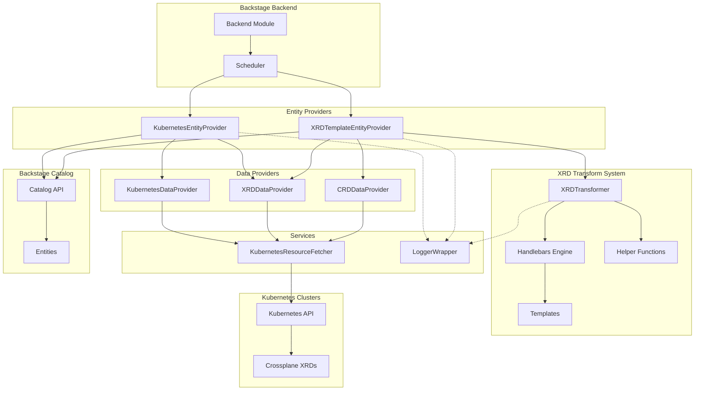

# Ingestor Plugin Architecture

## Overview

The Ingestor plugin is a Backstage backend module that automatically discovers Kubernetes resources and transforms Crossplane XRDs into Backstage entities. The plugin uses a modular architecture with a template-based transformation system for generating Backstage templates from XRDs.

## Directory Structure

```
ingestor/
├── src/
│   ├── backstage-plugin/         # Backstage integration
│   │   ├── entity-providers/     # Entity provider implementations
│   │   │   ├── XRDTemplateEntityProvider.ts   # XRD/CRD template generation
│   │   │   ├── KubernetesEntityProvider.ts    # K8s resource ingestion
│   │   │   └── index.ts
│   │   │
│   │   ├── interfaces/           # Type definitions
│   │   │   ├── BackstageLink.ts  # Link interface for entities
│   │   │   └── index.ts
│   │   │
│   │   ├── data-providers/       # Data fetching providers
│   │   │   ├── CRDDataProvider.ts           # Fetches CRD definitions
│   │   │   ├── XRDDataProvider.ts           # Fetches XRD definitions
│   │   │   ├── KubernetesDataProvider.ts    # Fetches K8s resources
│   │   │   └── index.ts
│   │   │
│   │   ├── services/             # Core services
│   │   │   ├── KubernetesResourceFetcher.ts # K8s API client wrapper
│   │   │   ├── LoggerWrapper.ts            # Winston logger adapter
│   │   │   └── index.ts
│   │   │
│   │   ├── module.ts             # Backend module registration
│   │   └── types.ts              # Plugin-specific types
│   │
│   ├── xrd-transform/            # XRD transformation tool (NEW!)
│   │   ├── cli/                  # CLI interface
│   │   │   └── xrd-transform-cli.ts    # Command-line tool
│   │   │
│   │   ├── lib/                  # Core transformation library
│   │   │   ├── transform.ts      # XRDTransformer class
│   │   │   └── types.ts          # Transform-specific types
│   │   │
│   │   ├── helpers/              # Template helper functions
│   │   │   └── index.ts          # Handlebars helpers
│   │   │
│   │   └── index.ts              # Public API exports
│   │
│   ├── index.ts                  # Main entry point
│   └── types.ts                  # Shared type definitions
│
├── templates/                    # Handlebars templates (NEW!)
│   ├── backstage/               # Main Backstage Template entities
│   │   └── default.hbs
│   ├── parameters/              # Scaffolder form parameters
│   │   └── default.hbs
│   ├── steps/                   # Scaffolder workflow steps
│   │   └── default.hbs
│   ├── api/                     # API documentation entities
│   │   └── default.hbs
│   └── README.md                # Template development guide
│
├── docs/                        # Documentation
├── config.d.ts                  # Configuration schema
├── package.json                 # Package metadata
└── tsconfig.json               # TypeScript configuration
```

## Architecture Diagram



## Component Overview

### 1. Backstage Plugin Layer

#### Entity Providers

**XRDTemplateEntityProvider**
- Discovers Crossplane XRDs from Kubernetes clusters
- Uses XRDTransformer to generate Backstage Template entities
- Supports annotation-based template selection
- Generates both Template and API documentation entities

**KubernetesEntityProvider**
- Discovers standard Kubernetes resources
- Converts resources to Backstage Component entities
- Extracts metadata and relationships
- Supports XR status link extraction

#### Data Providers

**XRDDataProvider**
- Fetches Crossplane Composite Resource Definitions
- Filters by labels and annotations
- Provides structured XRD data to entity providers

**CRDDataProvider**
- Fetches standard Kubernetes Custom Resource Definitions
- Used for CRD-based template generation

**KubernetesDataProvider**
- Generic Kubernetes resource fetching
- Supports any resource kind/version
- Namespace filtering and label selectors

#### Services

**KubernetesResourceFetcher**
- Wrapper around Kubernetes client
- Handles authentication and cluster connections
- Provides consistent error handling
- Supports multiple cluster configurations

**LoggerWrapper**
- Adapts Winston logger to plugin needs
- Consistent logging across components
- Debug and error tracking

### 2. XRD Transform System (NEW!)

The XRD Transform system is the core of template generation, using a modular Handlebars-based approach.

#### XRDTransformer Class

Located in `src/xrd-transform/lib/transform.ts`:

```typescript
export class XRDTransformer {
  private handlebars: typeof Handlebars;
  private templateDir: string;
  private helpers: ReturnType<typeof createHelpers>;

  async transform(xrdData: XRDExtractData, options?: TransformOptions): Promise<TransformResult>
  async transformBatch(xrdDataArray: XRDExtractData[], options?: TransformOptions): Promise<TransformResult>
}
```

**Key Features:**
- **Modular Templates**: Separate templates for parameters, steps, main structure
- **Helper Functions**: Custom Handlebars helpers for XRD processing
- **Annotation-Based**: Template selection via XRD annotations
- **Multi-Stage Rendering**: Parameters and steps rendered first, then composed

#### Template System

Templates are organized by function:

**Main Templates (`templates/backstage/`)**
- `default.hbs` - Standard Backstage Template entity structure
- Composes pre-rendered parameters and steps

**Parameter Templates (`templates/parameters/`)**
- `default.hbs` - Scaffolder form field generation
- Extracts properties from XRD schema
- Generates validation rules

**Step Templates (`templates/steps/`)**
- `default.hbs` - Scaffolder workflow definition
- Creates kubernetes:apply actions
- Handles catalog registration

**API Templates (`templates/api/`)**
- `default.hbs` - OpenAPI documentation generation
- Documents resource endpoints
- Includes schema definitions

#### Helper Functions

Located in `src/xrd-transform/helpers/index.ts`:

- `slugify(text)` - Convert text to URL-safe format
- `extractTitle(xrd)` - Get human-readable title
- `extractProperties(xrd)` - Parse schema properties
- `getAnnotation(xrd, key)` - Get annotation value
- `getLabel(xrd, key)` - Get label value
- `backstageVar(path)` - Preserve Backstage variable syntax
- `split(str, delimiter)` - Split comma-separated strings
- `trim(str)` - Remove whitespace

#### Annotation-Based Template Selection

XRDs can specify which templates to use:

```yaml
apiVersion: apiextensions.crossplane.io/v2
kind: CompositeResourceDefinition
metadata:
  name: databases.platform.io
  annotations:
    openportal.dev/template-api: "default"          # API docs
    openportal.dev/template: "default"              # Main template
    openportal.dev/template-parameters: "database"  # Custom form fields
    openportal.dev/template-steps: "gitops"         # Custom workflow
    openportal.dev/tags: "database,storage"         # Comma-separated tags
```

### 3. CLI Tools

#### XRD Transform CLI

Located in `src/xrd-transform/cli/xrd-transform-cli.ts`:

**Features:**
- Transform XRDs from files or stdin
- Entity type filtering (`--only template|api`)
- Custom template directories (`-t`)
- Output to files or stdout (`-o`)
- Verbose mode for debugging (`-v`)

**Usage:**
```bash
npx ts-node src/xrd-transform/cli/xrd-transform-cli.ts xrd.yaml --only template
```

**Wrapper Script:**
The workspace provides `scripts/xrd-transform.sh` for easier access:
```bash
./scripts/xrd-transform.sh template-namespace/configuration/xrd.yaml
```

## Data Flow

### Template Generation Flow

1. **Discovery**: XRDTemplateEntityProvider discovers XRDs from Kubernetes
2. **Fetch**: XRDDataProvider fetches XRD YAML via KubernetesResourceFetcher
3. **Extract**: XRD data is structured with metadata (cluster, namespace, etc.)
4. **Transform**:
   - XRDTransformer reads template configuration from annotations
   - Renders parameters template with XRD context
   - Renders steps template with XRD context
   - Composes main template with pre-rendered sections
5. **Parse**: YAML output is parsed into entity objects
6. **Register**: Entities are provided to Backstage catalog

### Resource Ingestion Flow

1. **Discovery**: KubernetesEntityProvider discovers resources from Kubernetes
2. **Fetch**: KubernetesDataProvider fetches resource YAMLs
3. **Extract**: Metadata and status links are extracted
4. **Transform**: Resources are converted to Component entities
5. **Enrich**: Links and relationships are added
6. **Register**: Entities are provided to Backstage catalog

## Configuration

The plugin supports extensive configuration:

```yaml
kubernetesIngestor:
  components:
    enabled: true
    excludedNamespaces:
      - kube-system
  crossplane:
    enabled: true
    xrds:
      enabled: true
      templateDir: ./custom-templates  # Optional custom templates
```

See [configuration.md](./configuration.md) for complete reference.

## Extension Points

### Custom Templates

Create custom templates for specific use cases:

1. **Copy built-in templates**:
   ```bash
   cp -r templates my-templates
   ```

2. **Modify templates**:
   ```bash
   vim my-templates/parameters/database.hbs
   ```

3. **Use via annotation**:
   ```yaml
   metadata:
     annotations:
       openportal.dev/template-parameters: "database"
   ```

4. **Configure plugin**:
   ```yaml
   kubernetesIngestor:
     crossplane:
       xrds:
         templateDir: ./my-templates
   ```

### Custom Helpers

Add custom Handlebars helpers in `src/xrd-transform/helpers/index.ts`:

```typescript
export function createHelpers() {
  return {
    myCustomHelper: (value: string) => {
      // Custom logic
      return transformedValue;
    },
    // ... other helpers
  };
}
```

## Testing

The plugin includes comprehensive testing:

- **Unit Tests**: Test individual components
- **Integration Tests**: Test complete transformation flows
- **CLI Tests**: Test command-line interface
- **Template Tests**: Test template rendering

Run tests:
```bash
yarn test
```

## Performance Considerations

- **Caching**: Template compilation is cached per XRDTransformer instance
- **Batch Processing**: Multiple XRDs can be transformed together
- **Scheduling**: Entity providers use configurable refresh intervals
- **Resource Filtering**: Namespace and label filters reduce API calls

## Security

- **RBAC**: Requires appropriate Kubernetes service account permissions
- **Template Validation**: Templates are validated before use
- **Input Sanitization**: XRD data is sanitized before template rendering
- **Secret Handling**: No secrets are included in generated entities

## Troubleshooting

### Template Errors

**Template not found:**
```
Error: Template not found: custom-template (and no default.hbs)
```
- Ensure template exists in `templates/{type}/` directory
- Check template name matches annotation value
- Verify `templateDir` configuration

**YAML parsing errors:**
```
Failed to parse template output as YAML
```
- Check template indentation (YAML requires precise spacing)
- Use `{{{variable}}}` for pre-rendered content (triple braces)
- Test template with `--verbose` flag

### Common Issues

1. **XRDs not discovered**: Check RBAC permissions
2. **Templates not generated**: Verify XRD has required schema
3. **Custom templates not loaded**: Check `templateDir` path
4. **Helper function errors**: Ensure helpers return correct types

## Migration from Legacy System

The plugin was refactored from a complex multi-layer architecture to the current template-based system:

**Removed:**
- `core/` - IngestionEngine, ResourceValidator, XRDEntityBuilder (~5,000 lines)
- `entity-builders/` - ParametersBuilder, StepsBuilder, TemplateEntityBuilder
- `template-handlers/` - XRDTemplateHandlerV1/V2
- `yaml-builders/` - OpenAPIDocBuilder, StepsYamlBuilder

**Added:**
- `xrd-transform/` - Modular transformation system
- `templates/` - Handlebars template files
- Annotation-based configuration

**Benefits:**
- ~5,600 fewer lines of code
- Easier to understand and maintain
- Template customization without code changes
- Clear separation of concerns

## See Also

- [Configuration Reference](./configuration.md)
- [XRD Transform Examples](./xrd-transform-examples.md)
- [Quick Start Guide](./quick-start.md)
- [CLI Tools Documentation](./cli-ingestor.md)
