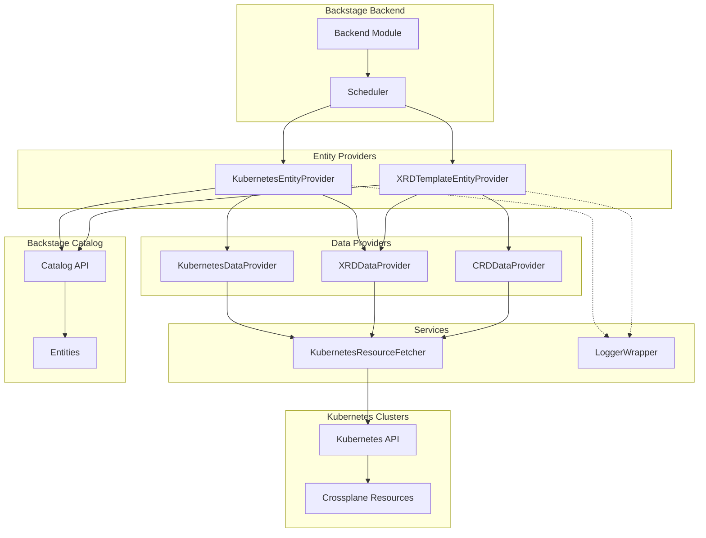
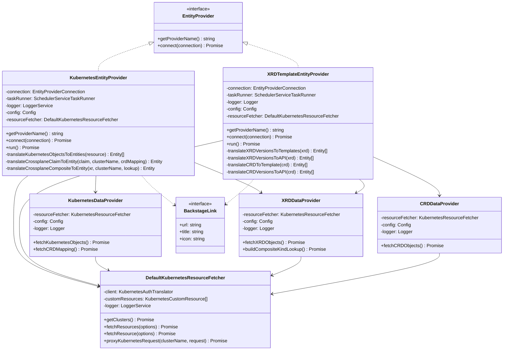
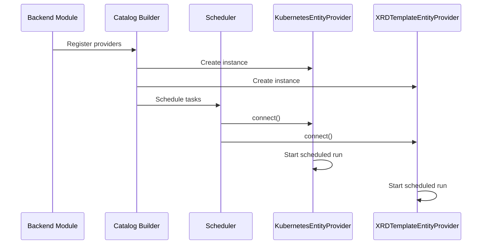
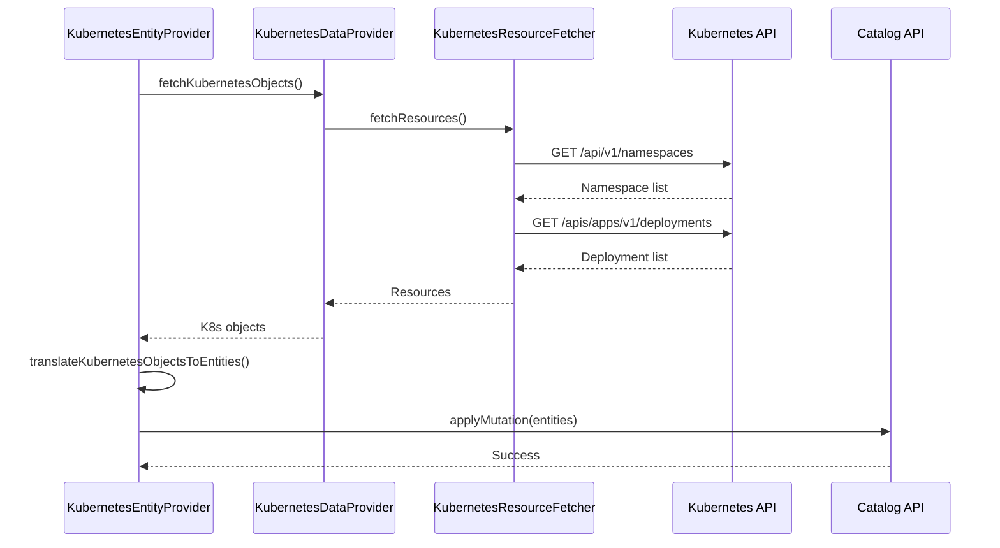
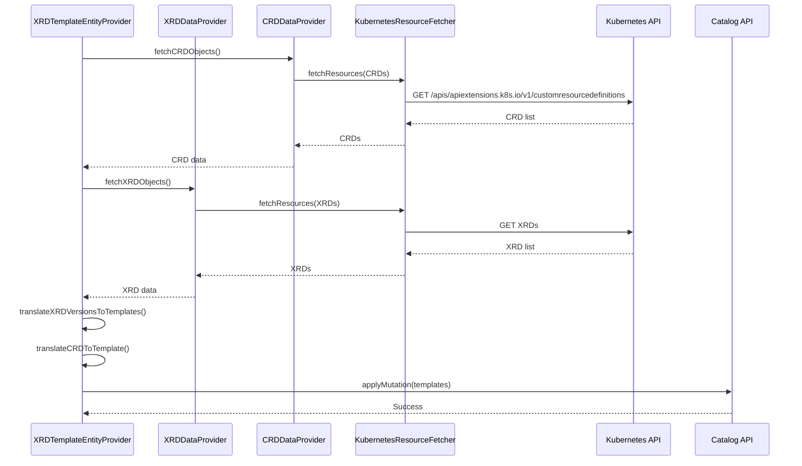
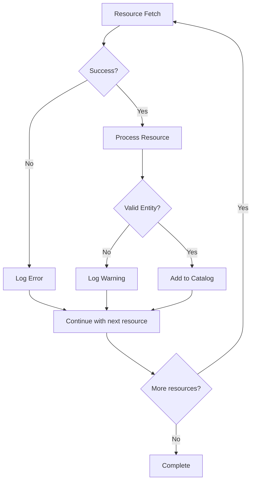

# Kubernetes Ingestor Plugin Architecture

## Overview

The Kubernetes Ingestor plugin is a Backstage backend module that automatically discovers and ingests Kubernetes resources into the Backstage catalog. It supports both standard Kubernetes resources and Crossplane resources (XRDs, CRDs, Claims, and Composites).

## Directory Structure

```
kubernetes-ingestor/
├── src/
│   ├── interfaces/              # Type definitions and interfaces
│   │   ├── BackstageLink.ts    # Link interface for Backstage entities
│   │   └── index.ts            # Barrel export
│   │
│   ├── entity-providers/        # Entity provider implementations
│   │   ├── XRDTemplateEntityProvider.ts    # Handles XRD/CRD template generation
│   │   ├── KubernetesEntityProvider.ts     # Handles K8s resource ingestion
│   │   └── index.ts                        # Barrel export
│   │
│   ├── data-providers/          # Data fetching providers
│   │   ├── CRDDataProvider.ts             # Fetches CRD definitions
│   │   ├── XRDDataProvider.ts             # Fetches XRD definitions
│   │   ├── KubernetesDataProvider.ts      # Fetches K8s resources
│   │   └── index.ts                        # Barrel export
│   │
│   ├── services/                # Core services
│   │   ├── KubernetesResourceFetcher.ts   # K8s API client wrapper
│   │   ├── LoggerWrapper.ts              # Winston logger adapter
│   │   └── index.ts                       # Barrel export
│   │
│   ├── providers/               # Re-exports for backward compatibility
│   │   └── index.ts            # Re-exports entity and data providers
│   │
│   ├── types.ts                # Shared type definitions
│   ├── module.ts               # Backend module registration
│   └── index.ts               # Main entry point
│
├── config.d.ts                 # Configuration schema
├── package.json               # Package metadata
└── tsconfig.json             # TypeScript configuration
```

## Component Flow Diagram



## Class Dependency Diagram



## Data Flow

### 1. Initialization Flow



### 2. Kubernetes Resource Ingestion Flow



### 3. Crossplane Template Generation Flow



## Key Features

### 1. Multi-Cluster Support
- Discovers resources across multiple Kubernetes clusters
- Maintains cluster context in entity metadata
- Configurable cluster discovery

### 2. Crossplane Integration
- **XRD Support**: Generates Backstage templates from Crossplane XRDs
- **CRD Support**: Creates templates for generic CRDs
- **Claim Processing**: Ingests Crossplane claims as components
- **Composite Resources**: Supports v2 Cluster/Namespaced XRs
- **Version Detection**: Automatically detects Crossplane v1 vs v2

### 3. Entity Generation
- **Components**: K8s workloads become Backstage components
- **Systems**: Namespaces/clusters mapped to systems
- **APIs**: OpenAPI specs generated from CRDs/XRDs
- **Templates**: Scaffolder templates for resource creation

### 4. Annotation Mapping
- Custom annotation prefix support
- Automatic label selector generation
- Link parsing for external references
- Owner and lifecycle mapping

## Configuration

The plugin is configured through `app-config.yaml`:

```yaml
kubernetesIngestor:
  enabled: true
  annotationPrefix: 'terasky.backstage.io'

  crossplane:
    enabled: true
    xrds:
      enabled: true
      publishPhase:
        target: github
        allowRepoSelection: true
      convertDefaultValuesToPlaceholders: false

  genericCRDTemplates:
    enabled: true
    publishPhase:
      target: github
      allowRepoSelection: true

  components:
    enabled: true

  mappings:
    namespaceModel: 'cluster'
    systemModel: 'namespace'
    referencesNamespaceModel: 'default'

  clusters:
    - name: 'production'
      authProvider: serviceAccount
      url: 'https://k8s-api.prod.example.com'
```

## Error Handling



## Performance Considerations

1. **Batch Processing**: Resources are fetched in batches to reduce API calls
2. **Scheduled Runs**: Uses Backstage scheduler to avoid continuous polling
3. **Parallel Fetching**: Multiple clusters processed in parallel
4. **Entity Validation**: Names validated before catalog insertion (63 char limit)
5. **Connection Reuse**: K8s client connections are reused across requests

## Security

- Uses Backstage's authentication framework
- Supports multiple auth providers (ServiceAccount, OAuth, etc.)
- Respects RBAC permissions in Kubernetes
- No credentials stored in code

## Extensibility Points

1. **Custom Resource Types**: Add new resource types via configuration
2. **Annotation Processors**: Extend annotation mapping logic
3. **Template Generators**: Custom template generation for specific CRDs
4. **Entity Transformers**: Override default entity generation logic

## Troubleshooting

### Common Issues

1. **Entities not appearing**: Check scheduler logs and K8s permissions
2. **Template generation fails**: Verify XRD/CRD schema validity
3. **Connection errors**: Validate cluster configuration and network access
4. **Name validation failures**: Ensure resource names are < 63 characters

### Debug Logging

Enable debug logging in `app-config.yaml`:

```yaml
backend:
  logger:
    kubernetesIngestor: debug
```

## Future Enhancements

- [ ] Support for custom resource filters
- [ ] Incremental updates instead of full sync
- [ ] Webhook-based real-time updates
- [ ] Enhanced error recovery mechanisms
- [ ] Performance metrics and monitoring